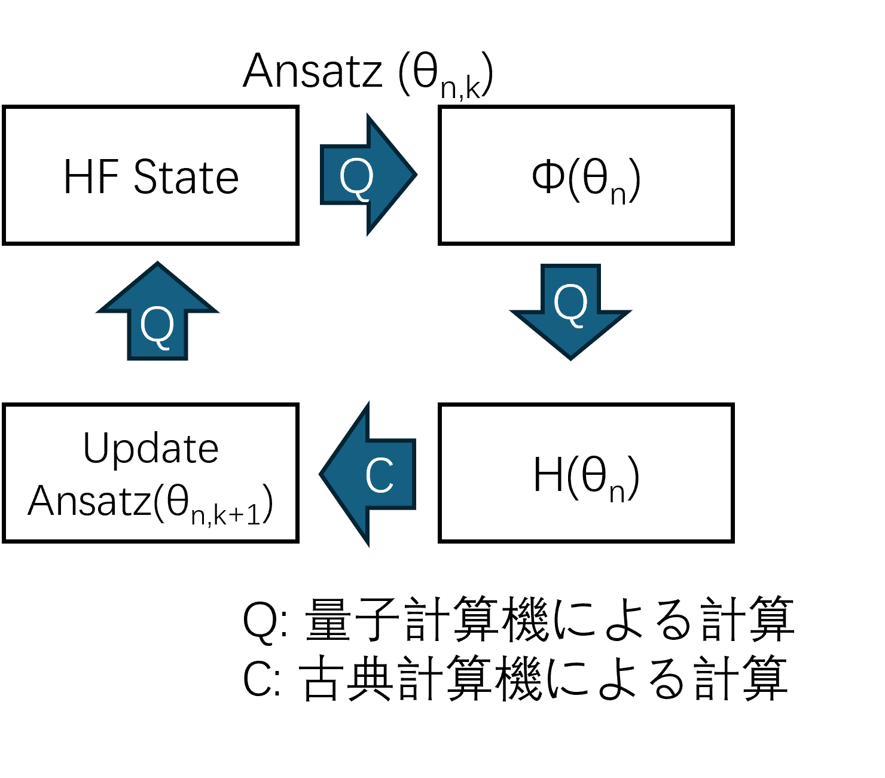
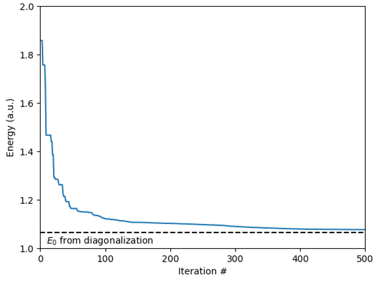
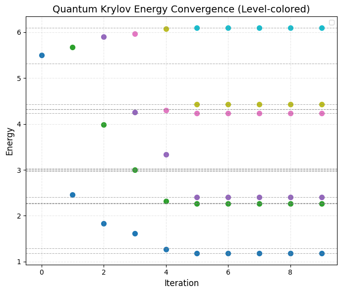

# Ground State Solver for Nuclei Hamiltonian up to 3-body Interactions by Quantum Computing
## Team "Quantum-4-body" Members
|Name|GitHub|Role|
|:-:|:-:|:-:|
|Ritsuki Ito|[@rit-3525](https://github.com/rit-3525)|Quantum Krulov Subspace|
|Rei Takezawa|[@onagonanja](https://github.com/onagonanja)|QPE|
|Zhihao Deng|[@Deng-Zhihao](https://github.com/Deng-Zhihao)|VQE code development|
|Hideyuki Nishida|[@hnishida](https://github.com/hnishida)|QKS|
|Yuto Morohoshi|-|Mentor|

## Target
Understanding nuclear dynamics is central to modern nuclear and particle physics. For the lightest systems, Hamiltonians with only two-body interactions often reproduce observed behavior. As nuclei grow—e.g., ³H and ⁴He—two-body models alone yield clear discrepancies with experiment, while adding irreducible three-body forces restores agreement. Unfortunately, faithfully treating three-body Hamiltonians strains classical computation because the Hilbert space and interaction terms scale steeply. Quantum computing offers a path forward: by natively representing quantum states and entanglement, it can reduce the cost of simulating realistic nuclear interactions. In this work, we benchmark several quantum algorithms for simulating three-body nuclear Hamiltonians and assess their accuracy, resource requirements, and prospects for near-term hardware.

## Method and Results
### 1. Quantum Phase Estimation

### 2. Variational Quantum Eigensolver

### 3. Quantum Krylov Subspace

## Reference
\[1] Steven C. Pieper, R. B. Wiringa, "Quantum Monte Carlo Calculations of Light Nuclei", [arXiv:nucl-th/0103005](https://arxiv.org/abs/nucl-th/0103005)  
\[2] J. Carlson et al., "Quantum Monte Carlo methods for nuclear physics", [arXiv:1412.3081](https://arxiv.org/abs/1412.3081)  
